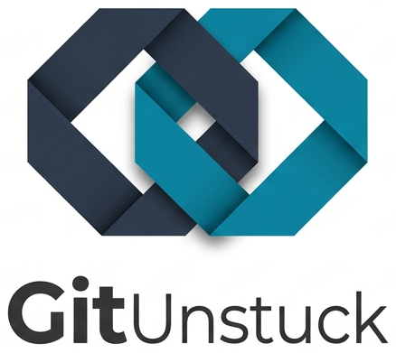

<div align="center">
  <picture>
    <source media="(prefers-color-scheme: light)" srcset="./assets/logo-light.png">
    <source media="(prefers-color-scheme: dark)" srcset="./assets/logo-dark.png">
    
  </picture>
</div>
<p />

> [!WARNING]
> This project is a work in progress.

GitUnstuck is an AI-powered tool designed to automatically resolve Git merge conflicts. It understands the context of your changes and can even fix compilation or test failures introduced during a rebase.

## Quick Start

### 1. Build the tool
```bash
make
```

### 2. Set your API Key
Depending on your preferred provider, set the corresponding environment variable:

```bash
# For Google Gemini (Default)
export GOOGLE_API_KEY="your-gemini-api-key"

# For OpenAI
export OPENAI_API_KEY="sk-..."

# For Anthropic
export ANTHROPIC_API_KEY="sk-ant-..."
```

## Typical Workflow: Resolving Rebase Conflicts

If you are in the middle of a rebase and hit conflicts:

1. **Start your rebase:**
   ```bash
   git rebase main
   # (Conflicts detected...)
   ```

2. **Run GitUnstuck to resolve conflicts and verify the build:**
   The following command will attempt to resolve conflicts, then use `go build` and `go test` to ensure the resolution didn't break anything.

   ```bash
   ./gitunstuck resolve \
     --build-cmd "go build ./..." \
     --test-cmd "go test ./..."
   ```

3. **Continue your rebase:**
   Once GitUnstuck finishes staging the resolved files:
   ```bash
   git rebase --continue
   ```

## Switching LLM Providers

You can switch between different AI providers using the `--provider` flag. Supported providers include: `google`, `openai`, `anthropic`, and `acp`.

- For `google`, `openai`, and `anthropic`, you can specify a model using the `--model` flag. If omitted, a default model will be used.
- For `acp`, you must provide the command to run the agent using the `--acp-command` flag.
